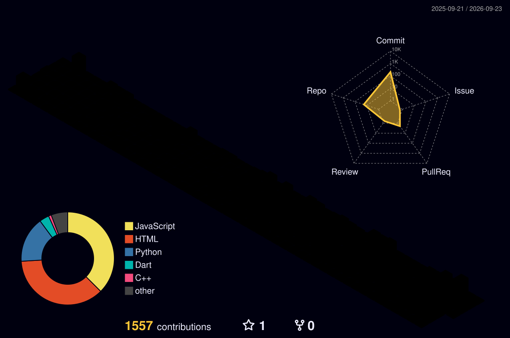

<div align="center">

<a href="https://github.com/abdullahjvd384">
  
</a>

<a href="https://github.com/abdullahjvd384">
  
</a>

<br/>

<a href="https://metaviz.pro">
  
</a>
<a href="https://www.linkedin.com/in/abdullahjvd384/">
  
</a>
<a href="mailto:abdullahjvd384@gmail.com">
  
</a>
<a href="https://abdullahjvd384.github.io/">
  
</a>
<a href="https://www.upwork.com/freelancers/~01f0a1c55cbc8d4ab7">
  
</a>

<br/>

<a href="https://github.com/abdullahjvd384">
  
</a>


</div>

---

### 👨‍💻 About Me

```python
class AbdullahJaved:
    def __init__(self):
        self.name         = "Abdullah Javed"
        self.nationality  = "Pakistani"
        self.role         = "AI / ML Engineer @ Metaviz"
        self.location     = "Lahore, Pakistan"
        self.education    = "B.S. Data Science, FAST-NUCES (2022–2026)"
        self.focus        = ["LLM fine-tuning", "RAG systems",
                             "AI agents & automation", "production ML APIs"]
        self.stack        = ["Python", "PyTorch", "FastAPI", "LangChain", "Docker"]
        self.currently    = "Building AI voice agents, RAG platforms & ETL pipelines"
        self.ask_me_about = ["LLMs", "RAG", "MLOps", "AI automation"]

    def say_hi(self):
        print("I build AI systems that ship — from notebook to production.")
```

I'm an **AI/ML Engineer** who turns research-grade models into systems that actually run in production — LLM fine-tuning, RAG pipelines, AI voice agents, ETL, and multimodal deep learning for real-world clients. I care about both **model quality** and **system reliability**: the model has to be good *and* the API has to stay up.

**Currently focused on**
- **LLM systems** — RAG pipelines, LLM fine-tuning, prompt engineering, context-aware chatbots
- **AI agents & automation** — voice agents (Retell / ElevenLabs), N8N / Make / Zapier workflow orchestration
- **ML engineering** — FastAPI microservices, Docker, CI/CD, ETL pipelines, MLOps

---

### 🚀 Selected Projects

| Project | What It Does | Stack |
|---|---|---|
| [**Student Learning & Career Assistant** (FYP)](https://github.com/abdullahjvd384/SLCA-project) | RAG academic platform ingesting PDFs & audio to deliver personalized learning paths | FastAPI, RAG, Pinecone, PostgreSQL |
| [**Blogify — AI Blog Platform**](https://github.com/abdullahjvd384/Blogify) | AI blogging platform with LLM content-review agents, RAG pipelines & writer monetization | LLMs, RAG, MongoDB |
| [**Multimodal Fake News Detection**](https://github.com/abdullahjvd384/fake-news-detector) | Text + CNN image ensemble over 10K samples to detect fake articles & images | PyTorch, ResNet-50, EfficientNet, FastAPI |
| [**Gemini PDF Chatbot**](https://github.com/abdullahjvd384/gemini-pdf-chatbot) | End-to-end RAG over arbitrary PDFs — chunk → embed → retrieve → generate | LangChain, Gemini, Streamlit |
| **AI Product Recommendation System** | NLP engine analyzing purchase history for personalized e-commerce recommendations | NLP, scikit-learn, Python |
| [**Cricket Squad Prediction System**](https://github.com/AmmarAhm3d/Optimal-Cricket-Team-Prediction-ML-DL) | 5K+ player records → squad prediction with K-Means / RF + Power BI dashboards | scikit-learn, Pandas, Power BI |

---

### 🧑‍🔬 Experience

**AI / ML Engineer** · **Metaviz** — Lahore, Pakistan · `Jul 2025 – Present`
- Built **AI voice agents** for real estate clients (Retell, ElevenLabs, GoHighLevel), automating inbound lead qualification and cutting manual call-handling time
- Developed **ETL pipelines** for Handyman Services, Real Estate, and Africa Travel Hub
- Shipped a **Nutrition Calculator** with automated calorie estimation, eliminating manual dietary logging
- Designed **5+ N8N automation workflows** (Meeting Scheduler, AI Content Generation) integrated with Zapier & Cassidy
- Built a **context-aware real-estate chatbot** maintaining chat history for personalized responses
- Architected **FastAPI microservices** containerized with Docker, with CI/CD via GitHub Actions

---

### 🛠️ Tech Stack

**Languages**
<p>
  
  
  
  
  
</p>

**AI / ML / DL**
<p>
  
  
  
  
  
  
  
  
  
</p>

**LLM & GenAI**
<p>
  
  
  
  
  
  
</p>

**Backend & APIs**
<p>
  
  
  
  
  
  
</p>

**Databases**
<p>
  
  
  
  
</p>

**Automation & No-Code AI**
<p>
  
  
  
  
  
  
  
</p>

---

### 🌐 GitHub in 3D

<div align="center">
  
</div>

---

### 📊 Stats at a Glance

<div align="center">


<br/>


</div>

---

### 📈 Contribution Activity

<div align="center">
  
</div>

<picture>
  <source media="(prefers-color-scheme: dark)" srcset="https://raw.githubusercontent.com/abdullahjvd384/abdullahjvd384/output/github-contribution-grid-snake-dark.svg"/>
  <source media="(prefers-color-scheme: light)" srcset="https://raw.githubusercontent.com/abdullahjvd384/abdullahjvd384/output/github-contribution-grid-snake.svg"/>
  
</picture>

---

### 🏆 Trophy Cabinet

<div align="center">
  
</div>

---

### 📜 Certifications

- **AI Engineer for Data Scientists Associate** — DataCamp
- **Finetuning Large Language Models** — DeepLearning.AI
- **Improving Accuracy of LLM Applications** — DeepLearning.AI
- **ChatGPT Prompt Engineering for Developers** — DeepLearning.AI
- **Data Visualization with Python** — IBM

---

<div align="center">

### 🤝 Let's Build Something

**Working on an AI product? I take it from model to deployed API.**

<a href="https://www.linkedin.com/in/abdullahjvd384/">
  
</a>
<a href="mailto:abdullahjvd384@gmail.com">
  
</a>
<a href="https://www.upwork.com/freelancers/~01f0a1c55cbc8d4ab7">
  
</a>

<br/><br/>

<i>Building AI systems that are reliable, deployable, and actually useful.</i>
<br/><br/>


</div>
